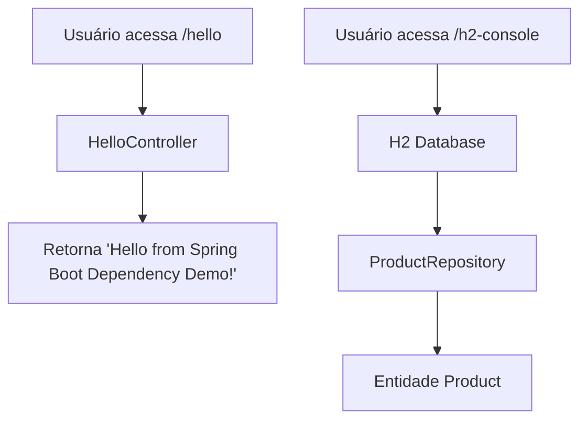

# 📦 Spring Boot Dependency Demo

Este projeto demonstra como o Spring Boot simplifica o gerenciamento de dependências através do Spring Boot BOM (spring-boot-dependencies).

👉 Não precisamos especificar versões de bibliotecas como Spring Web, Spring Data JPA ou H2, pois o Spring Boot gerencia automaticamente.

## 🎯 Objetivos

- Explicar o Dependency Management do Spring Boot.
- Criar um HelloController simples.
- Configurar uma entidade Product e um ProductRepository usando JPA.
- Utilizar banco de dados H2 em memória.

## 🗂 Estrutura de Pastas

```plaintext
spring-boot-dependency-demo/
 ├── build.gradle.kts
 ├── settings.gradle.kts
 └── src
     ├── main
     │   ├── java/com/example/dependency
     │   │   ├── SpringBootDependencyDemoApplication.java
     │   │   ├── controller/HelloController.java
     │   │   ├── entity/Product.java
     │   │   └── repository/ProductRepository.java
     │   └── resources/application.properties
     └── test/java/com/example/dependency
         └── SpringBootDependencyDemoApplicationTests.java

```

## 📊 Fluxograma – Ciclo da Aplicação


